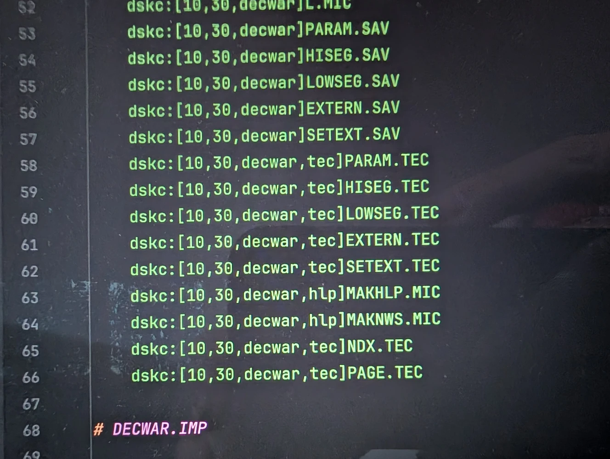
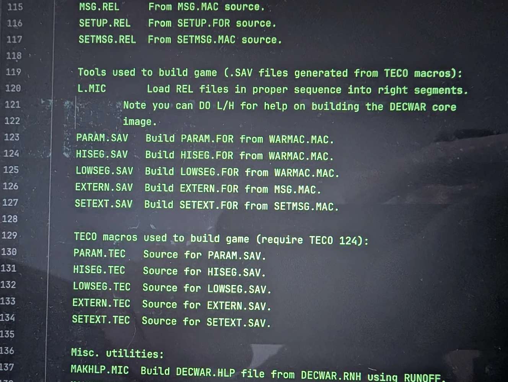

The Decwar developers did not simply use the standard tools provided by the PDP-10 platform; they forged a sophisticated, multi-stage pipeline tailored to the specific demands of their project. This custom toolchain is a powerful indicator of their deep, practical understanding of the system's architecture, particularly in the context of memory management and the interoperability between Fortran and assembler.

Central to this toolchain was TECO (Text Editor and Corrector), a powerful and historically significant tool whose use connects the Decwar project to the very roots of the hacker culture of the PDP-1 era, as chronicled by Steven Levy. In this context, TECO was not used as a simple text editor but as a potent code generator. This act demonstrates a specific cultural response, a refusal to accept the base language's inadequacies, which is a hallmark of the hacker ethos. In an era before modern build systems, this macro-driven workflow served as a primitive but highly effective form of dependency management and code generation.

The developers wrote TECO macros (.TEC files) that functioned as a meta-language to control and augment Fortran. Its primary function was to extract specific content from larger master source files and auto-generate derivative source files meticulously prepared for compilation. The purpose of this extraction was a deliberate architectural strategy to overcome the limitations of the platform and its languages. By generating modular Fortran INCLUDE files, the developers could programmatically enforce consistency and manage critical resources:

* Parameters (PARAM.FOR): A single, authoritative source for game constants was extracted from WARMAC.MAC, ensuring that parameters were centralized and consistent across the entire Fortran codebase.

* Memory Segments (HISEG.FOR, LOWSEG.FOR): Common blocks were automatically defined and extracted to force data structures into specific high and low memory segments, a critical technique for managing the limited address space.

* Text Strings (EXTERN.FOR, SETEXT.FOR): External declarations for text strings were generated from MSG.MAC. This enabled two key architectural goals: it allowed the team "to force text into the high segment" and to sidestep the "annoying trailing blanks Fortran generates for literals."

This workflow revolved around a clear relationship between three key file types, forming a simple but powerful toolchain:

* .TEC files: These are the human-readable TECO macro source files. They contain the logic and commands for the build tools and, according to project documentation, require TECO version 124 to function.

* .SAV files: These are the executable TECO macros generated from the .TEC sources. They function as the build tools themselves, performing the extraction and generation tasks.

* .FOR files: These are the final Fortran source code files generated by the .SAV macros. They contain critical definitions and declarations ready to be included by the main program.

The following table details the primary code generation processes, illustrating how master source files were parsed by TECO tools to create essential Fortran components.

| TECO Macro Source (.TEC) | TECO Macro Tool (.SAV) | Input Source File | Output File (.FOR) | Purpose |
| :---- | :---- | :---- | :---- | :---- |
| PARAM.TEC | PARAM.SAV | WARMAC.MAC | PARAM.FOR | Defines parameters (constants). |
| HISEG.TEC | HISEG.SAV | WARMAC.MAC | HISEG.FOR | Defines the High segment common block. |
| LOWSEG.TEC | LOWSEG.SAV | WARMAC.MAC | LOWSEG.FOR | Defines the Low segment common block. |
| EXTERN.TEC | EXTERN.SAV | MSG.MAC | EXTERN.FOR | Defines External declarations for strings used in Decwar. |
| SETEXT.TEC | SETEXT.SAV | SETMSG.MAC | SETEXT.FOR | Defines equivalent external declarations used by SETUP code. |

This auto-generation of code played a central role. The generated .FOR files, such as PARAM.FOR (defining constants) and HISEG.FOR (defining the high-segment common block), are not standalone programs. They are critical dependencies that are subsequently incorporated directly into the main DECWAR.FOR source code using an INCLUDE directive. This system of code generation ensured that parameters and memory layouts defined in several master source files, such as WARMAC.MAC for parameters and common blocks, and MSG.MAC for text strings, were propagated consistently throughout the program. Once these source files are auto-generated, the process moves to compilation and linking.

Beyond TECO, the .MIC files and MICRO interpreter represent another layer of this sophisticated process. MICRO was a convention for executable scripts that automated TOPS-10 Monitor command lines, much like modern shell scripts.

* L.MIC was used as a custom "sophisticated linker". It took the various relocatable object files (.REL files) generated from both Fortran and MACRO assembly code sources and loaded them in the correct sequence and into the proper memory segments to produce the final DECWAR.EXE file.

* Documentation Tools (MAKHLP.MIC, MAKNWS.MIC) were used to build the user-facing help and news files from their respective sources, using the RUNOFF documentation formatter. Their inclusion on the SDT demonstrates that the custom toolchain was designed to manage the entire project lifecycle, from code compilation to end-user documentation.

* Indexing and Search were aided by two TECO macros. NDX.TEC is the source for NDX.SAV, which creates DECWAR.NDX, a file listing DECWAR.FOR routines and their page numbers. PAGE.TEC is the source for PAGE.SAV, which searches the DECWAR.NDX file to find the page number for a given subprogram, aiding in source code editing.

* Content Management was automated via CONTEN.MIC, a MICRO tool used to create contents for a MACRO file, recompile it, and generate and print a CREF listing.

This intricate toolchain was the engine that enabled the game's unique software architecture, a structure born directly from the necessity of navigating a sophisticated workflow.

