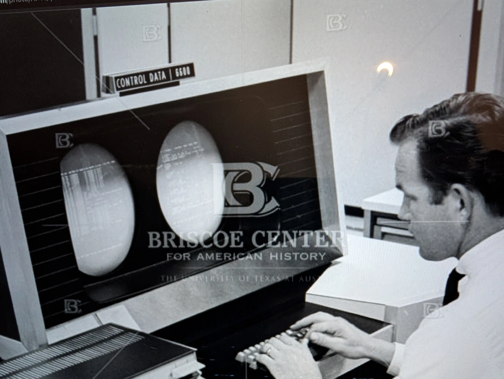
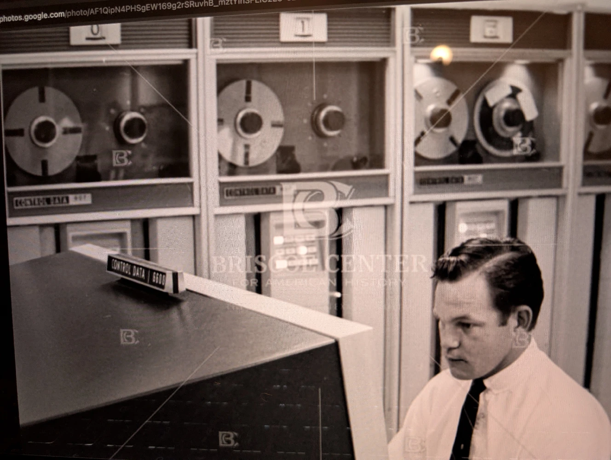

Decwar evolved from an earlier two-player game called simply War, written in Fortran on the UT Austin Computation Center CDC 6600 Mainframe. In fact, the CDC 6600 is often classed as the first successful Supercomputer, designed by Seymour Cray and released in 1964\. When the UT Austin Computation Center PDP-10 became available, the War code was adapted and evolved by moving roughly half the code from Fortran into MACRO-10 assembly code. Combined with the Mainframe-class PDP-10 hardware, this made eighteen simultaneous players possible. All of these contexts are apparent in the Decwar build process.

The complex build process was not an end in itself; it was the means to create a specific software architecture designed to function optimally within the PDP-10's environment. The final structure of Decwar is a direct reflection of the solutions its developers devised to utilize the platform's capabilities. The game's design is, in essence, an embodiment of its own creation story.

A core feature of this architecture is its hybrid-language structure. The use of both high-level Fortran (DECWAR.FOR, SETUP.FOR) for game logic and low-level MACRO assembler (WARMAC.MAC, MSG.MAC) for data and text management was a deliberate choice. Fortran provided the necessary computational power, but it lacked the fine-grained control over memory layout and text handling that the developers required. By offloading text and critical data definitions to the assembler and then programmatically including them back via TECO and auto-generated Fortran code, they achieved the best of both worlds.

This approach was central to the game's sophisticated memory management strategy. On a typical PDP-10 system of the era, memory was a severely limited resource, placing immense pressure on developers. Memory was made of magnetic cores, an individual small torus or donut of magnetic material for each bit. Core memory has been invented for the Whirlwind and SAGE computers in the mid fifties and was still dominant through the sixties. It was necessarily expensive and a limited resource, small donuts of magnetic material simply do not scale up well. The architecture reflects a relentless focus on conservation, where techniques for saving every possible byte were not merely clever but absolutely necessary for the game to function.

* Segmented Memory. The game's memory was explicitly divided into a high segment and a low segment. This division was not left to chance; it was enforced by dummy routines (HIGH.FOR, LOW.FOR) and orchestrated by the custom linker (L.MIC), ensuring that data and code were placed in precise locations.

* One-Time Initialization Code. The game utilized initialization routines (SETUP.FOR, SETMSG.MAC) that ran only once, when the game started. Discussion in the commentary files makes clear that this code was "deleted from core" or "thrown away" after its purpose was served. This tactic was applied with multiple layers of sophistication; for instance, the generated file SETEXT.FOR "will be loaded into the Low-segment during SETUP, and thrown away after entering the game proper," revealing a multi-stage process of memory reclamation even within the setup phase.

This carefully engineered structure, a direct product of its toolchain, is the very object that modern-day efforts now seek to preserve and understand.

Following the generation of necessary source files, the compilation and linking phase begins. This is the assembly line of the build process, where disparate source components are transformed into a single, cohesive executable image. This stage is marked by careful management of the program's memory layout, a critical concern in the resource-constrained environments of the era.

The process consists of two main stages:

* Compilation: In this stage, the primary source files are compiled into relocatable object files (.REL files). This includes the main Fortran source (DECWAR.FOR), the MACRO assembly source (WARMAC.MAC), and the various generated source components. Key output files from this stage, as documented in DECWAR.IMP, include DECWAR.REL, WARMAC.REL, HIGH.REL, and LOW.REL. These object files contain machine code but are not yet a runnable program, as their final memory addresses have not been resolved.

* Linking: The responsibility for assembling the final executable falls to L.MIC, identified in the documentation as a "sophisticated linker." This tool takes the collection of .REL object files and binds them together, resolving symbolic references and creating the final Decwar.EXE file.

The role of L.MIC extends beyond simple linking. It is explicitly responsible for orchestrating the memory layout of the final program. Its key function is to load the .REL files in the proper sequence and, critically, to force specific common blocks into the correct high or low memory segments. This is achieved using what the developers' own notes call "dummy routines", HIGH.FOR and LOW.FOR, which serve as anchors for the linker to place the HISEG and LOWSEG common blocks into their designated memory regions. The tool's sophistication is further evidenced by a note in the source documentation: "Note you can DO L/H for help on building the Decwar core image," indicating a built-in help system for developers.

