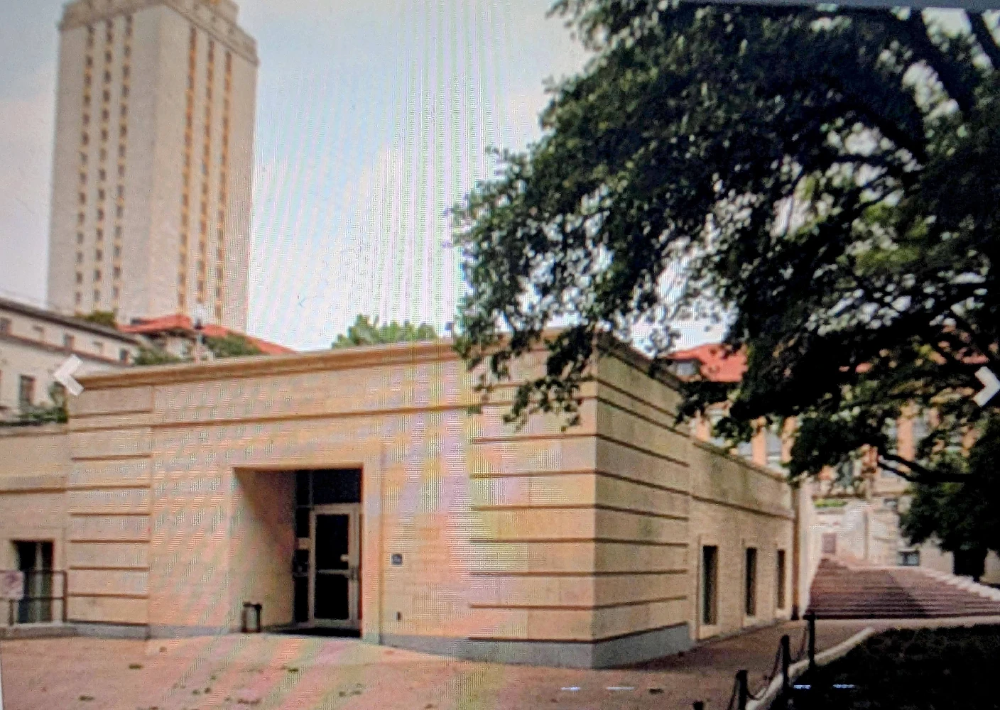
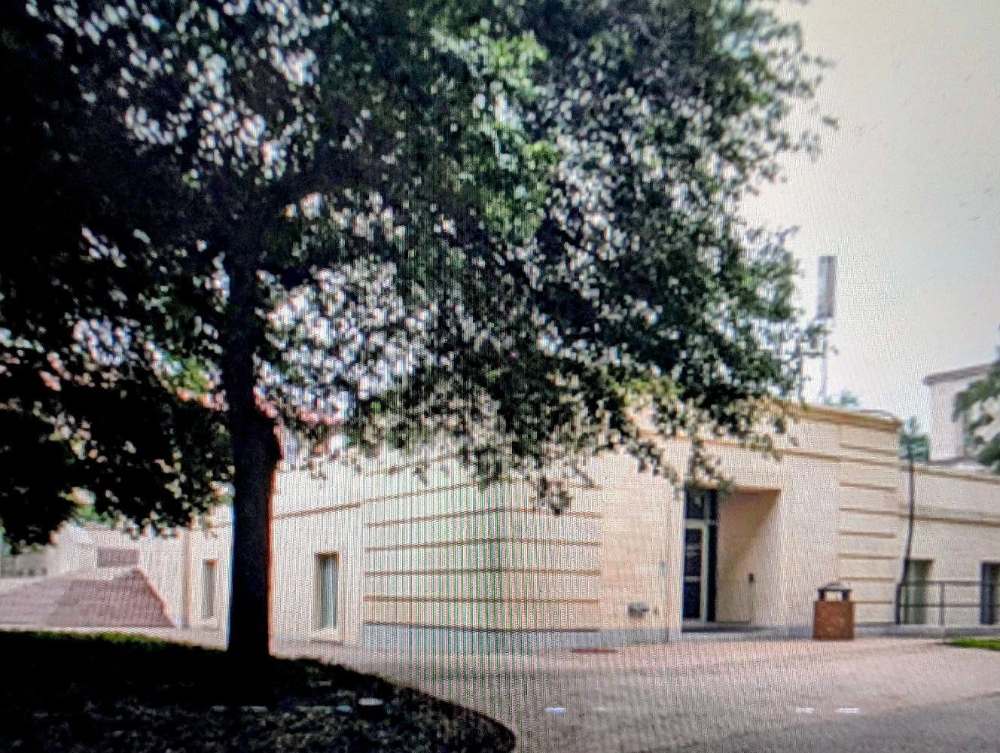

The preservation of a software artifact like Decwar has cultural and historical value for what its creation reveals about a specific technological moment. Project SDT, through its source tape reconstruction effort, is engaged in a form of digital archaeology. This work moves beyond simply archiving a playable artifact; it is a deep investigation into resurrecting the entire ecosystem in which the game was born. An ecosystem centered on the UT Computation Center (UTCC).

The Decwar build system is a powerful and remarkably complete example of how a platform's unique characteristics profoundly influence software design. The PDP-10's memory architecture, the capabilities of its available tools, and its surrounding cultural heritage were not passive backdrops; they were active forces that shaped the game's final form. Every architectural choice, from the hybrid-language model to the segmented memory, can be traced back to a challenge that had to be overcome or a tool that could be cleverly exploited.

In this artifact, we can see a clear line of influence from the early "hacker" ethos of tool-building and system mastery, represented by the deep and inventive use of TECO, to the disciplined, large-scale software engineering required to build a persistent, multi-user game. The process reveals a UTCC development culture that was at once creative and highly pragmatic.

The project's explicit goal is to precisely match the contents of the original Source Distribution Tape. The file DECWAR.TAP serves as the authoritative blueprint, the foundational document that dictates every source file, tool, and intermediate object required for a faithful reconstruction. It is an exacting process, guided by the principle of historical accuracy.

Ultimately, studying historical build processes like that of Decwar uncovers the hidden labor, the contextual pressures, and the sheer ingenuity embedded within software artifacts. The legacy of Decwar is therefore twofold: a landmark game, and the enduring lesson that a platform's architecture is not merely a foundation, but an active, cultural force that dictates the very shape of ingenuity.

The Decwar build process represents a remarkably well-documented and sophisticated example of software development practices from its era. Its key characteristics—a reliance on a central manifest in DECWAR.TAP, the innovative use of TECO macros for automated code generation, and sophisticated control over memory segmentation during the linking stage—demonstrate a mature and disciplined approach to software engineering. This system was designed not just to produce an executable, but to be a maintainable and distributable development environment in its own right.

The historical significance of this process lies in its completeness. It provides a clear window into how complex software was constructed before the advent of modern integrated development environments and standardized build tools. The TECO-based workflow, in particular, is a direct link to the foundational principles of text-based automation that defined early software development.

The significance of this effort lies in its experiential value. By resurrecting the entire build environment, Project SDT allows technical historians to move beyond theoretical analysis. This reconstruction allows us to witness the culture in action: the discipline reflected in the meticulous DECWAR.TAP manifest, the pragmatism of discarding initialization code to save precious bytes, and the self-reliant ingenuity of a team that built its own tools to bend the platform to its will. With DECWAR.TAP as the blueprint, Project SDT is meticulously rebuilding the historic structure brick by digital brick.

This work of digital archaeology led directly to a modern preservation breakthrough. The practical outcome is a fully functional, simulated development environment within a concrete functional artifact. The collected files are written to a SIMH tape image, which is then used to perform a "fresh Decwar build on every SIMH PDP-10 start." This means that each time the simulation runs, it is not merely loading a pre-compiled game; it is re-enacting the original, complex build process from scratch using the reconstructed tools and source materials, as they were in the UTCC of the seventies and eighties. This image allows for a fresh, authentic Decwar build to be executed on a modern emulation of the original PDP-10 hardware, preserving not just the final game but the entire software ecosystem and the intricate process that brought it to life.

