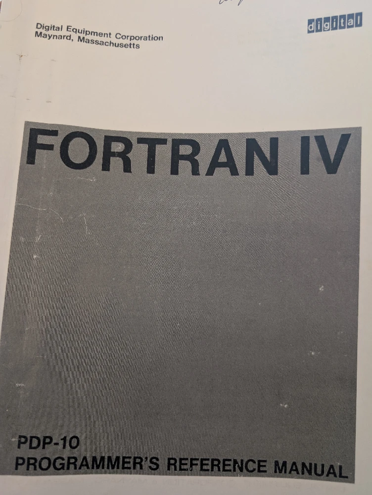
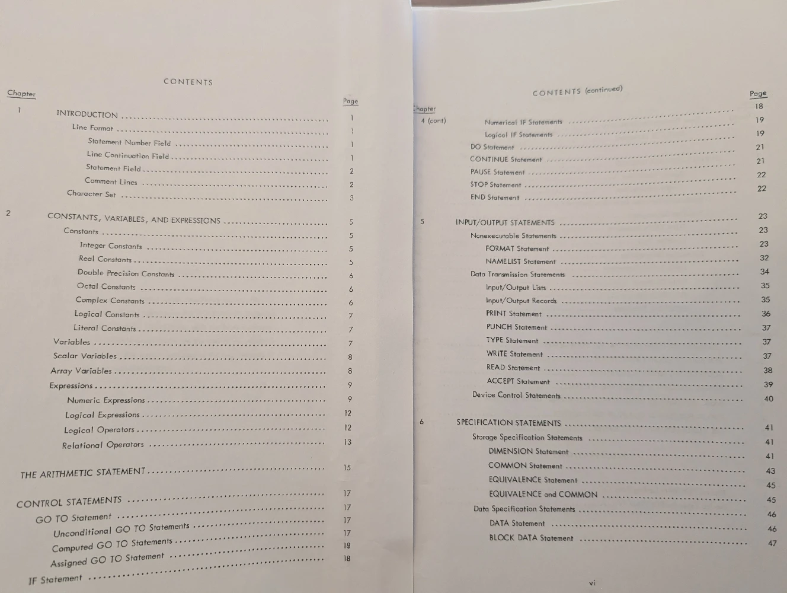

To understand an artifact like Decwar, one must first understand the environment in which it was forged. The DEC computing ecosystem of the sixties and seventies was a landscape defined by a specific set of tools and programming languages. The Decwar build system is deeply embedded in the DEC ecosystem of the era, utilizing a suite of proprietary assemblers, linkers, and non-standard language extensions. These were not merely implements; they were the fundamental building blocks and conceptual frameworks available to developers, shaping how problems were perceived and solved.

The primary high-level language used for Decwar was Fortran IV. However, Fortran IV was far from standardized in the sense associated with modern high-level languages. To enable its modular, auto-generated code structure, the project required an INCLUDE statement, but an examination of Fortran IV documentation from the sixties reveals the absence of INCLUDE. Fortran IV was rooted in and strongly associated with the punch card era of computing, when a program and its source code meant a physical deck of punch cards. Even the concept of an INCLUDE statement does not make sense when working with punch cards. One needed to simply physically include the necessary punch cards in the deck being fed into the punch card reader.

The INCLUDE statement used by Decwar was a DEC-specific extension that allowed the compiler to pull in the contents of another file during compilation. DEC famously extended Fortran IV to provide more powerful features, a prime example being the INCLUDE statement. This practice was part of the larger Fortran Wars of the time, where hardware manufacturers like DEC offered proprietary extensions that, while empowering their own developers, created platform-specific incompatibilities that fragmented the programming landscape. While essential for the DECWAR build process, this type of proprietary language extension created incompatibilities with other Fortran compilers and was a key issue in the Fortran Wars.

Even a cursory examination of the DECWAR.TAP file manifest reveals a crucial architectural insight. The original distribution contained only a single primary Fortran source file, DECWAR.FOR. Recognizing that the original design was monolithic simplifies the understanding of the build architecture. This monolithic design underscores the importance of the automated tooling; without a reliable way to generate and INCLUDE consistent common blocks and parameters, maintaining such a codebase would have been error-prone. This file architecture provides the foundation for understanding the dynamic processes that brought them together to build the final executable.

