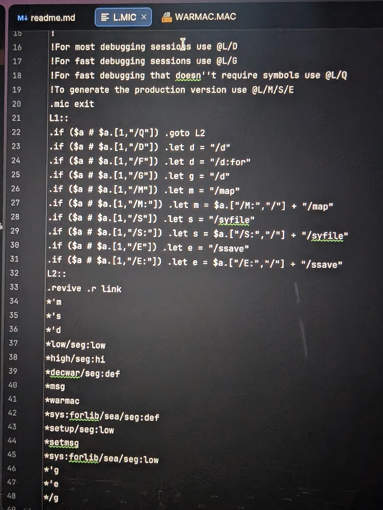
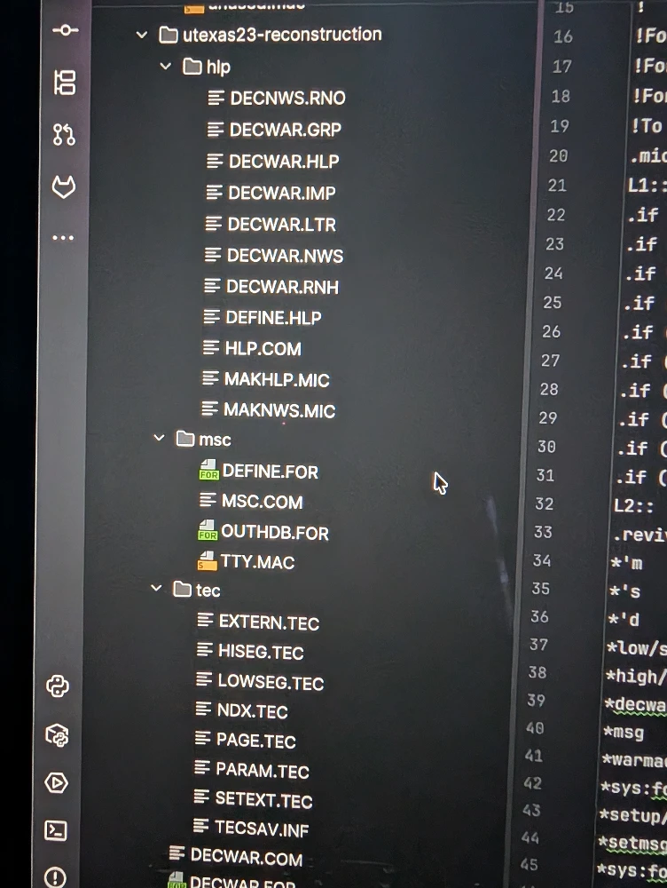

The creators of Decwar did not simply use the standard DEC tools; they composed them into a sophisticated, automated build system. This practice of "tool-making", writing scripts to control other programs, demonstrates a mature development culture focused on efficiency, consistency, and solving complex, platform-specific problems. They built a toolchain that transformed raw source material into a fully linked executable and its accompanying documentation with methodical precision.

The architecture of Decwar is a direct and compelling reflection of the DEC ecosystem’s unique character. Its monolithic Fortran core, its hybrid assembly structure, its reliance on INCLUDE statements, and its intricate, automated build process were all shaped by powerful tools, proprietary extensions, and the expense of magnetic core memory. The game's source code is a testament to developers who intimately understood their environment and engineered elegant solutions to its challenges. They used TECO to generate code, MICRO to control memory layout, and MACRO to overcome the shortcomings of Fortran, demonstrating a mastery of their toolset.

A prime example of this is the automatic generation of Fortran code using TECO. The developers wrote TECO scripts, which they referred to as "macros," to process the MACRO assembler source files. We can note there are several different uses of the term “macro” here, including as a general-purpose script and as a specific style of metaprogramming within assembly language. TECO scripts scanned over files like WARMAC.MAC to extract parameters and memory definitions and auto-generated Fortran INCLUDE files such as PARAM.FOR, HISEG.FOR, and LOWSEG.FOR. This is a remarkably early and interesting example of automatic code generation, creating a single source of truth in the assembler code files and propagating it consistently into high-level Fortran code.

This culture of automation extended to documentation. The developers used RUNOFF, one of the first text-formatting languages, to compile user-facing documents. RUNOFF source code in DECWAR.RNH and DECNWS.RNO were processed by RUNOFF to generate the final DECWAR.HLP help file and DECWAR.NWS news file. In this, we can see the direct ancestor of troff on Unix, which in turn influenced a whole lineage of text formatting markup languages such as LaTeX and Markdown. These innovative techniques were not implemented for their own sake; they were practical solutions born from the necessity of working within the DEC ecosystem.

In these practices, we see the seeds of techniques that would become central to software development in the decades that followed. The automated documentation builds using RUNOFF prefigured modern Documentation-as-Code workflows, while the use of TECO for code generation is an early forerunner of modern build systems and preprocessors. The story of Decwar is therefore a story about how technological platforms both arise from a specific technical and cultural context and, in turn, provide the very structure that determines what their users can imagine and, ultimately, create.

Excavating the Decwar toolchain is not merely an academic exercise; it reveals a system that, while technologically primitive, was a clear progenitor of several core principles in modern software engineering. The developers solved timeless problems of complexity, consistency, and automation with the tools available to them, creating patterns that remain relevant today.

* Build Automation. The orchestrated use of TECO, RUNOFF, and MICRO scripts to manage a multi-stage process is an unmistakable ancestor to modern build systems. Tools like make, Gradle, and contemporary CI/CD pipelines fulfill the same fundamental role of automating a complex sequence of code generation, compilation, testing, and linking to produce a final artifact from a set of source files.

* Metaprogramming and Code Generation. The TECO macro process, extracting data from .MAC files to generate .FOR include files, is a classic example of metaprogramming. This practice directly embodies the "Don't Repeat Yourself" (DRY) principle by maintaining a single source of truth for shared data. It is the conceptual ancestor of modern build-time code generation, annotation processing, and other techniques used to write code that writes other code, ensuring consistency and reducing boilerplate.

* Documentation-as-Code. The use of RUNOFF to compile help files from version-controlled .RNH and .RNO text sources prefigured the modern paradigm of treating documentation as a first-class deliverable. Today, projects using tools like Sphinx, Javadoc, or Markdown-based static site generators follow the same principle. Documentation lives alongside the source code, is versioned with it, and is built as an integral part of the development and release pipeline.

* Linker Scripting. The precise memory-mapping capabilities of the L.MIC script are a direct forerunner of modern linker scripts. While general-application developers rarely need this level of control, it remains a critical technique in specialized domains like embedded systems, operating system kernel development, and other performance-critical applications where controlling the exact placement of code and data in memory is essential for correctness and efficiency.

These parallels demonstrate that the challenges of building complex software are perennial, and the foundational solutions developed decades ago continue to inform the tools and practices we use today. The Decwar system was conceptually advanced for its time, even if the underlying technology appears primitive by today's standards. The developers created a remarkably sophisticated and automated workflow that addressed challenges still faced by software engineers today: ensuring consistency, managing complexity, and automating repetitive tasks. These elegant integrations demonstrate a mature and holistic approach to software construction. This system solved complex dependency and memory management problems using the limited tools available, establishing a single source of truth in the assembly code and propagating it automatically throughout the Fortran source and final executable. Ultimately, engaging in this kind of "software archaeology" provides more than just a historical curiosity; it offers a deeper appreciation for the foundational principles of build automation and system architecture that underpin all of modern software engineering.

