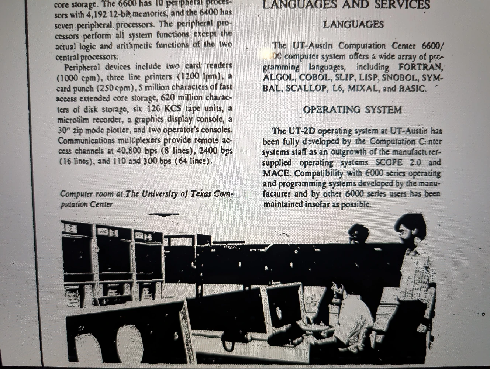

The defining characteristic of the UT Austin Computation Center in the 1960s was its pursuit of the most advanced hardware available. In the summer of 1966, the university made a landmark investment of $5,926,850 to acquire a CDC 6600 supercomputer. The physical environment required for such a machine was significant. The CDC 6600 was installed underground, east of the Main Building on the UT Austin campus. The underground location was likely necessitated by the machine’s cooling requirements and its sheer complexity. The system contained 400,000 transistors and more than 100 miles of internal wiring. Cooling was achieved using a Freon refrigerant system that circulated through metal plates in contact with "cordwood" modules—tightly packed circuit boards designed to keep wire lengths short and signal speeds high.

At the time of its installation, the CDC 6600 was the fastest computer in the world, having surpassed the IBM 7030 Stretch by a factor of three. This acquisition placed UT Austin in an elite group of scientific institutions, as the 6600 was primarily found in nuclear research laboratories like Los Alamos and Lawrence Radiation Laboratory. Its most significant feature was its 60-bit word size, which directly addressed the center's core mission. This large word size was the key to unlocking the high-precision and wide dynamic range required for advanced floating-point computation, cementing the UTCC's role as a leader in this domain. The pursuit of "large computers" such as the 6600 and the 36-bit mainframes was synonymous with the pursuit of superior floating-point capability. A larger word size, meaning more bits in the machine's registers, provided a greater dynamic range and higher precision for calculations. This technical feature was not an abstract goal but the essential enabler for the complex numerical work undertaken at the center.

In addition to the 6600, the Computation Center expanded its hardware ecosystem throughout the 1960s and 1970s to balance the needs of batch processing and interactive computing. This included the acquisition of a CDC 6400, a less expensive model that used a serial central processor instead of the 6600's parallel functional units, and the utilization of the CDC 3000 series for commercial and smaller-scale scientific tasks.

The CDC 6600 was equipped with 131,072 (60-bit) words of central memory, while the CDC 6400 contained 65,636 words. The two computers were linked via 500,000 words of extended core storage, enabling efficient data sharing and processing between the mainframes. The architecture utilized a large number of independent peripheral processors (PPs) to manage input/output operations, a design crucial for handling the diverse academic workload of batch jobs and interactive sessions. The CDC 6600 was equipped with 10 PPs featuring their own 12-bit memories, while the CDC 6400 had seven PPs.

The facility was equipped with two card readers, three high-speed line printers, and a card punch for traditional batch processing workflows. Data was managed across a tiered storage system that included 5 million characters of fast-access extended core storage (a separate, high-speed peripheral unit), 620 million characters of disk storage, and magnetic tape units for archival and data transfer purposes. The Center supported advanced visualization and data representation through a microfilm recorder, a graphics display console, and a plotter. Connectivity for remote users was provided by communications multiplexers offering channels at multiple speeds, including a high-speed 40,800 bps link, a standard 2400 bps connection, and lower-speed 110/300 bps lines for interactive terminals.

The sophistication of the UT-Austin Computation Center is most evident in its software environment. The decision to develop a custom operating system, paired with the provision of a vast library of programming languages, demonstrates a strategic commitment to creating a versatile, high-performance, and user-focused platform. This ecosystem was tailored to serve the specific needs of a diverse academic community, from undergraduate students to advanced researchers.

At the heart of the center's software was UT-2D, an operating system fully developed in-house by the Computation Center's systems staff. Evolving from the manufacturer-supplied SCOPE 2.0 and MACE systems, UT-2D was engineered with a key innovation: a "preemptive-resume scheduling" feature. This scheduler automatically prioritized jobs based on their anticipated resource demand, or cost. The critical impact of this design was its direct alignment with the university's educational mission. Because student jobs—typically for compiling and running smaller programs—tend to be low-cost, the system automatically gave them the highest priority, ensuring rapid turnaround times and a responsive experience for the largest segment of the user base.

A core component of the software environment was the TAURUS remote timesharing system. As an integral part of the UT-2D operating system, TAURUS provided a powerful and highly reliable implementation of timesharing services. Its design philosophy is captured in its full name—Texas Anthropocentric Ubiquitous Responsive User System. This naming was not incidental; it signaled a deliberate focus on the human user experience during an era when computing was often machine-centric and intimidating, framing TAURUS as a philosophical counterpart to the student-focused scheduling of UT-2D. TAURUS supported a large variety of console terminals as well as more advanced graphic terminal devices, extending the Center's resources directly to users across campus.

The Center supported an extensive and diverse array of programming languages, a testament to its mission to serve a wide spectrum of academic disciplines. The available languages included FORTRAN, ALGOL, COBOL, SLIP, LISP, SNOBOL, SYMBAL, SCALLOP, L6, MIXAL, and BASIC. This collection provided tools for everything from numerical and scientific computing to business data processing, list processing, and symbolic manipulation.

* Compilers. The library included compilers for the most common high-level languages: ALGOL, BASIC, COBOL, and FORTRAN.

* File Management. The RFMS (Remote File Management System) provided crucial tools for users to manage their data and programs.

* Statistical Analysis. The inclusion of SPSS (Statistical Package for the Social Sciences) highlights the Center's direct support for quantitative research in social science disciplines.

* General Purpose Computing. OMNITAB II offered a general-purpose interpretive system for a broad range of computational tasks.

* Utilities. A variety of essential utility programs for plotting (PLT) and text editing (EDITOR, TEXEDIT) were readily available to all users.

