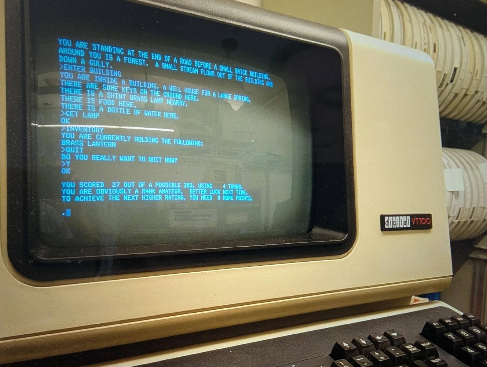
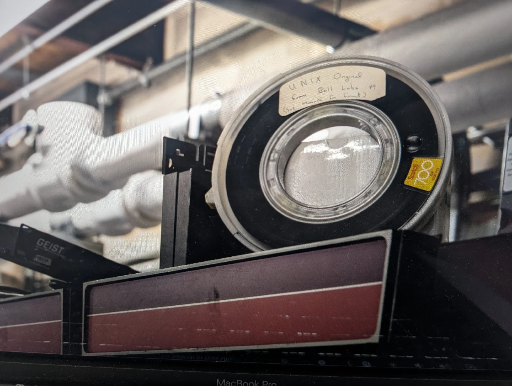

The Decwar SDT serves as a remarkable archaeological record, preserving not just the game's code but the very practices of its creators. The process of reconstructing this artifact is akin to a digital excavation, where the DECWAR.TAP file, a listing of the original tape's contents, acts as the site map. This file is the key to distinguishing the original architecture from later modifications.

Essential to interpreting this map are the commentary files, which function as Rosetta Stones for the project. These documents, DECWAR.IMP (IMP for “implementation”) and several .COM files (COM for “commentary"), contain the developers' own notes, explaining the purpose of the myriad files and the relationships between them. Without this guidance, the logic of the source code's organization would be harder to decipher.

These records reveal an archaeological finding. The game's core logic originally resided within a single, monolithic Fortran file, DECWAR.FOR. The dozens of separate Fortran files seen in modern repositories are anachronistic, an probably associated with CompuServe.

Recognizing this fact is significant for understanding the game's original hybrid structure, which contrasted the massive Fortran core with a collection of smaller, targeted MACRO assembler files like WARMAC.MAC and MSG.MAC. While Fortran handled the main gameplay, the MACRO assembler was employed to solve specific technical challenges associated with Fortran IV and with the DEC environment.

Based on the developers' commentary, the motivations for this hybrid approach were precise and pragmatic. Dummy Fortran routines, specifically HIGH.FOR and LOW.FOR, were used to implement memory segmentation. Containing no game logic, their sole purpose was to provide anchors for the linker to correctly place shared memory blocks (HISEG.FOR and LOWSEG.FOR) into distinct high and low memory segments. The developers used the assembler to handle text strings, noting that it allowed them to "get rid of the annoying trailing blanks Fortran generates for literals," a subtle but important optimization for both memory and display. Setup routines (SETUP.FOR, SETMSG.MAC) were written as separate modules that could be "deleted from core after initialization," a crucial technique for conserving precious memory during gameplay.

The DECWAR build process was far more than a simple sequence of compilation and linking. It was a multi-stage pipeline that automated the generation of source code and documentation from master files before assembling the final executable. The following sections provide a step-by-step deconstruction of this workflow, demonstrating how code generation, documentation compilation, and sophisticated linking were integrated into a single, automated system.

The first stage of the build process involved automated code generation using TECO macros. TECO, a powerful text editor of the era, was leveraged as a primitive scripting engine. A series of scripts with a .TEC extension were executed to process the primary MACRO assembler source files, specifically WARMAC.MAC, MSG.MAC, and SETMSG.MAC. These scripts would "crawl over" the assembly code, extract specific information, and reformat it as valid Fortran code. This process automatically generated several critical Fortran files, which were then used throughout the rest of the project.

The strategic purpose of this metaprogramming was to establish the assembly code as the single source of truth for shared parameters, memory layouts (common blocks), and external text strings. By auto-generating the corresponding Fortran INCLUDE files, the developers ensured consistency and eliminated the risk of manual data entry errors between the assembly and Fortran domains. This entire mechanism, however, relied on a non-standard feature of DEC's Fortran IV compiler, the INCLUDE statement.

Concurrent with source code preparation, the Decwar build process also automated the creation of user-facing documentation using RUNOFF. As one of the earliest text-formatting systems, RUNOFF is a direct ancestor of modern tools like troff, LaTeX, and the entire "documentation-as-code" paradigm. It allowed developers to write documentation in plain text files with simple formatting commands and then "compile" them into polished, final documents.

Within the DECWAR project, RUNOFF scripts were used to process text-based source files like DECWAR.RNH and DECNWS.RNO. This compilation produced the final, formatted documents that were shipped with the game, DECWAR.HLP (the help file) and DECWAR.NWS (the news file). The integration between the project's different toolchains is evident in how this process was invoked. The use of MICRO scripts, MAKHLP.MIC and MAKNWS.MIC, to control the RUNOFF compiler demonstrates the types of automations that have become common with command shell scripts and Python. MICRO is notable for providing parsing of the arguments in the calling command line and the ability to respond with primitive help messages. This is a direct ancestor of modern scripting tools. After generating both the necessary Fortran includes and the user documentation, the pipeline could proceed to the final stage of creating the executable program.

The final and most complex stage of the build was orchestrated by a MICRO script L.MIC which is described as the “sophisticated linker”. Today this script would probably be described as a wrapper around the DEC linker. L.MIC contains the sequence of commands to be entered at the monitor and linker prompts. The same effect can be achieved manually by a human typing at a terminal. MICRO and L.MIC automate that and remove the human from the loop. It dictates the precise sequence for loading the various object files to ensure correct symbol resolution and program structure. The script was used to explicitly force specific Fortran common blocks (HISEG and LOWSEG) into distinct high and low memory segments. This was accomplished by linking dummy Fortran routines (HIGH.FOR and LOW.FOR) whose sole purpose was to declare the HISEG and LOWSEG common blocks, respectively, thereby anchoring them to the desired memory regions during the linking process. This level of granular control over memory was essential for the game's operation on the PDP-10’s core memory system, and showcases a level of sophistication typically associated with modern systems programming. L.MIC is perhaps an ideal showcase of MICRO as a primitive scripting language.

