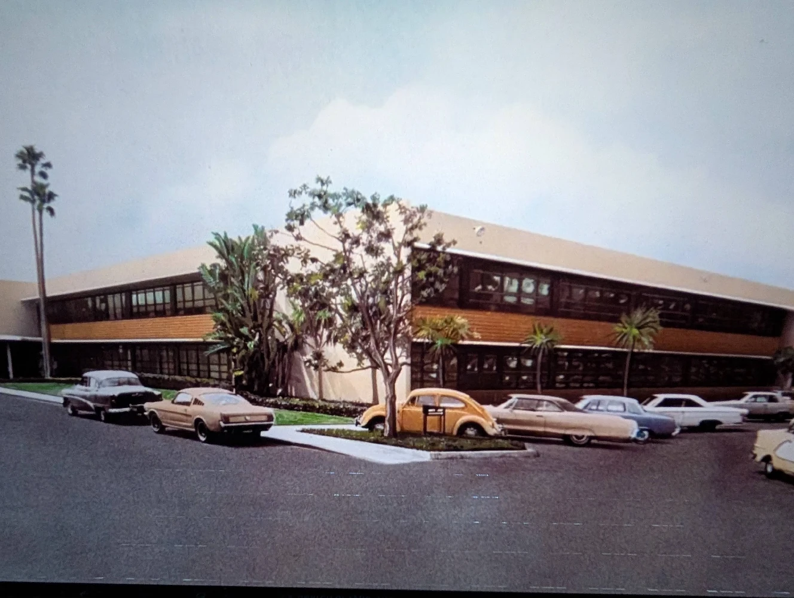
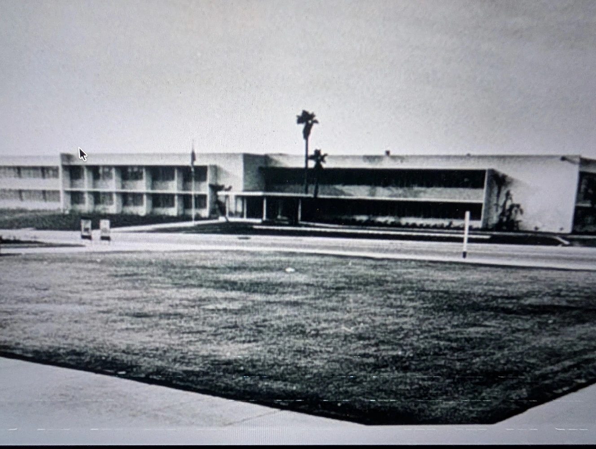

The Cold War and ensuing Space Race were a context where military imperatives, academic breakthroughs, and shrewd political maneuvering converged, creating the conditions for a world-class computational facility to take root in Austin. The direct influence of LBJ was a driving force behind federal investment in Texas. LBJ's well-established ties to the aerospace industry in Dallas helped steer contracts and development to the region. The establishment of the Manned Spacecraft Center in Houston was a signature achievement of this effort, anchoring the Apollo program in Texas.

Concurrent with these industrial and federal developments, UT Austin experienced a rapid increase in funding, enabling its ambition to become a top-tier research institution. UT provided a unique and essential combination of academic skills and computational resources that were vital to the Cold War mission, particularly in aerospace. The university became a center of excellence in geodesy, gravity field determination, and orbit determination, skills fundamental not only to the space and missile programs but also to regional economic drivers like Texas oil exploration.

The strategic convergence of elite talent, state-of-the-art supercomputing hardware, and targeted federal funding allowed UT to institutionalize its expertise. The creation of the UT Computation Center established UT as a national center for supercomputing, aerospace research, and numerical analysis for a generation. From this base, it projected its influence directly into the nation's most critical Cold War aerospace and defense research programs.

The 1958 National Defense Education Act formalized the Space Race and established the federal government's significant role in education through student loans, fellowships, and curriculum support. It marked the first time the federal government injected significant funding into higher education, framing it as a matter of national security. The results were transformative, creating the modern American university system and the federal student loan infrastructure. It effectively militarized the justification for education funding, leading to a golden age of American research universities. It converted the U.S. education system from a local responsibility into a key component of national security policy.

The Space Race was an expression of a much broader cultural and ideological zeitgeist that defined the fifties and sixties. This era was defined by a profound faith in big science, systems analysis, and centralized, computer-driven problem-solving. It was also marked by an equally dramatic transformation of this worldview in the subsequent decade, with the seventies becoming an era of limits and inward-looking Earth-centered humanism.

This was also a period of profound geographic and political realignment in the American scientific-industrial complex. There was a purposeful migration of leading researchers from defense-oriented corporations and laboratories back into universities. This was explicitly the means by which sensitive technologies were released into the broader commercial and educational spheres, via the individuals directly involved, making the interpersonal links between leading researchers central to understanding what was taking place.

Driven by powerful political and economic forces, the center of gravity for aerospace and computational research began a shift from its established base in Southern California to the rapidly emerging ecosystem in Texas. This movement was effectively a dispersal of the Los Angeles aerospace and Cold War researchers, seeding their expertise into new academic institutions as part of a new national network for computational science.

A particularly powerful connection was forged between UT Austin and the NASA Jet Propulsion Laboratory in Los Angeles. This relationship was so strong and influential that it became widely known by its moniker, the UT Mafia. A key figure in cementing this bond was Byron Tapley, founder of the UT Center for Space Research. Even earlier, in the fifties, there were already important researchers binding California to Texas. The roles of George Dantzig and David Young and their ties with the Los Angeles based RAND and TRW corporations are explored in depth here.

RAND and TRW were the intellectual and industrial engines of the American Cold War. While the military provided the funding and the mandate, these two organizations provided the strategy and the systems engineering that built the U.S. nuclear arsenal and space program. Their early histories are deeply intertwined with the U.S. Air Force’s desire to harness scientific brainpower outside of the traditional military hierarchy. Safe in their Santa Monica headquarters, RAND civilians pioneered Operations Research, Game Theory, and Systems Analysis. If RAND provided the theory, TRW provided the management for Los Angeles based contractors (Lockheed, North American Aviation, Douglas Aircraft, Northrop, Hughes Aircraft) to build the hardware, creating the modern discipline of Systems Engineering.

