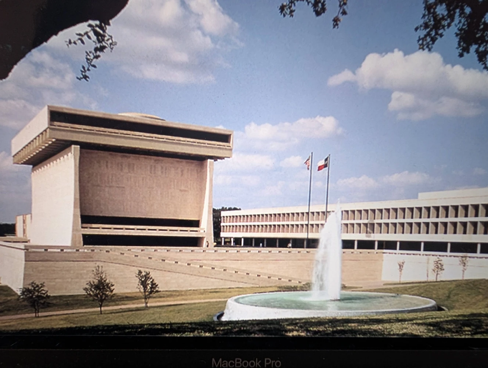
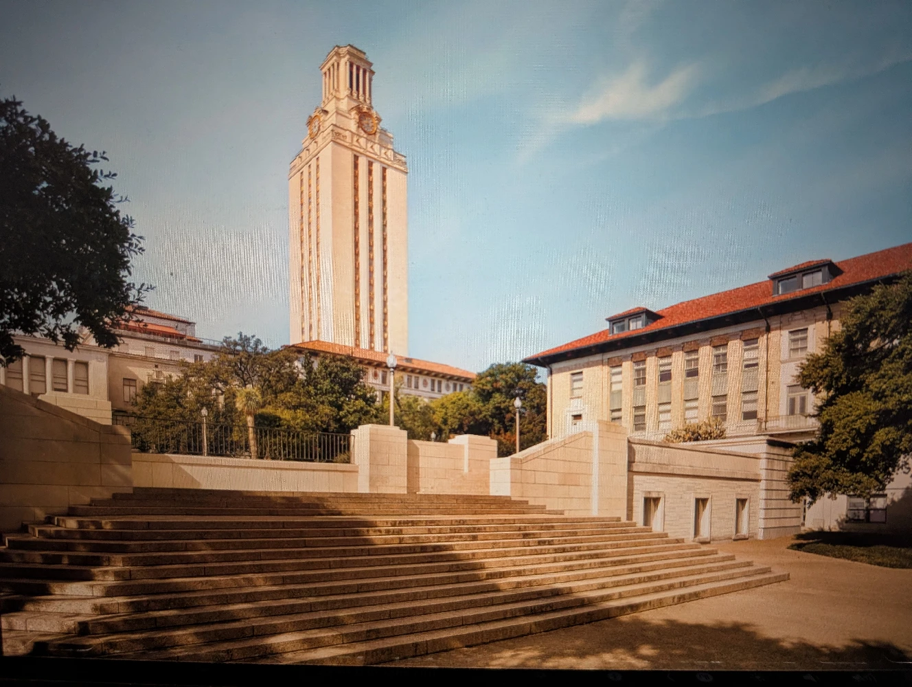

The evidence indicates that the LBJ presidency, from late 1963 to early 1969, was a catalyst for this shift, leveraging his political power to cultivate a new technological corridor in his home state. The interconnected developments of the 1960s demonstrate his influence. This confluence of political, industrial, and academic expansion positions LBJ not merely as a benefactor but as a prime political architect of the technological ecosystem that culminated in the UTCC’s 1966 acquisition of a state-of-the-art CDC 6600 supercomputer. This was the institutional capstone of these powerful, politically-driven forces.

Fittingly, a specially designed building was created to house the supercomputer, just to the east of the UT Tower, at the head of the East Mall. This unique building still bears the simple name of Computation Center, though it has long since become obsolete and been repurposed as a backup emergency data center. It is built of the local tan colored limestone, like most of the classic campus buildings, but is uniquely mostly underground, with the Tower’s wide eastern terrace as its roof. This underground location is said by some to be so that it doesn’t block views of the Main Building and Tower. Others say that the motivation was the CDC 6600’s cooling requirements and its sheer complexity. The system contained 400,000 individual transistor components and more than 100 miles of internal wiring. Cooling was via a Freon refrigerant system that circulated through metal plates in contact with tightly packed circuit boards designed to keep wire lengths short and signal speeds high.

In any case, from the Computation Center’s broad terrace roof, a wide flight of stairs descends to the East Mall and directly faces a unique landmark complex of buildings in the distance, the Lyndon B. Johnson Presidential Library. The view and scene are ideal, as the Library is a superb embodiment of the fifties and sixties era and a monument to the spirit of those times. It is a "living Star Trek set" giving architectural form to an era that believed the world's problems could be solved through operations research, systems analysis, and computational power. One can easily imagine Captain Kirk and Mr. Spock beaming down besides the Library’s main Tower, an utterly unique Space Age masterpiece.

This was the worldview that drove the Apollo program. Big science took on bureaucratic form in a proliferation of research centers and, at UT Austin, physical form in the establishment of the Pickle Research Campus, isolating sensitive Cold War projects far from the main campus. J.J. Pickle was at the heart of LBJ’s inner-circle, and the name is a fitting reminder of the era. The political and geographic transformations driven by the LBJ era set the stage for a series of highly consequential technological decisions that would define the university's future role in national research.

The creation of the UTCC and its associated academic centers was part of the national effort to ensure that the practical knowledge forged by Cold War and Space Race efforts was communicated into new academic disciplines, creating a lasting foundation for future generations of scientists and engineers. The objective here is to trace how that process took place in two particular cases: the work of two researchers, George Dantzig and David Young, at two companies, RAND and TRW, and how both of these currents flowed into and shaped the ensuing growth of UT Austin.

As part of tracing these two intellectual currents, some background context is helpful. Both currents, the work of Dantzig and that of Young, share a deep underlying basis in mathematics and physics. A deepened understanding of the nature of this underlying reality is in fact one of the types of knowledge that was clarified and transferred by the new academic channels created during this period. The structure and content of the textbooks, courses, and even departments were completely reshaped in the fifties and sixties. The fact they have been fairly stable for the following five decades points out how definitive the changes were. As part of exploring the stories of Dantzig and Young, this underlying context will be pointed towards and foreshadowed where appropriate, in preparation for a dedicated discussion of floating-point hardware and computerized linear algebra.

Floating-point hardware lagged behind the general-purpose digital computer. Digital computing became practical during the forties and then grew explosively into a powerful tool during the fifties under the impulse of the Cold War and Space Race, while floating-point hardware developed more slowly across the fifties and sixties. It was not at all obvious from the beginning that floating-point would play the critical role that it did. In fact, John von Neumann famously opposed putting effort into floating-point. That story will be explored here as an example of how the course of events was not at all obvious and straightforward to the researchers involved at the time, and to highlight the pragmatic roles played by Dantzig and Young.

The raw power of early digital computers could only be unlocked through the creation of systematic, repeatable algorithms. This marked a fundamental change in approach for problem-solving; a decisive move away from an adhoc, human-centric expert art, towards the standardized, machine-executable automated science of rigorous mathematical procedures. The intuitive calculation methods of the pre-computer era had to be replaced with standard algorithms that could be expressed in computer code and then executed automatically, a shift essential for solving problems at a scale previously unimaginable.

This was the birth of modern linear algebra, numerical analysis, scientific computing, and computational science. In the fifties and sixties, this field was largely synonymous with the complex challenge of solving systems of linear equations, using applied linear algebra executed with pure floating-point arithmetic on the most advanced machines available. Later, the overarching terms supercomputing and high-performance computing would also become synonymous with this field. It was here that the careers of key individuals like George Dantzig and David Young flourished. They were computational pioneers whose expertise was shaped in the dense aerospace and defense milieu of Southern California. The professional connection between them was forged within this Los Angeles ecosystem, rooted in the shared and foundational discipline of numerical computing. 

